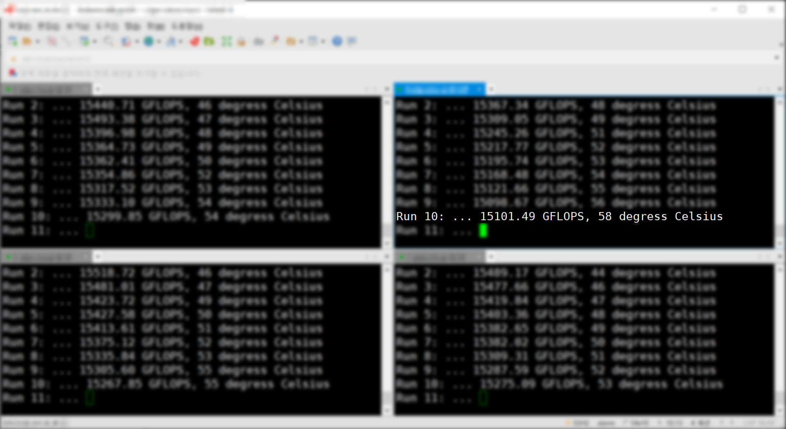

# gpu-stress-test

## 개요

NVIDIA GPU 드라이버는 GPU 온도가 일정 수준 이상으로 올라가면 자동으로 GPU의 동작 클럭을 낮춥니다.
이는 하드웨어를 보호하기 위한 조치이지만 대신 GPU 계산 성능이 그만큼 떨어지게 됩니다.
특히 일반 공냉식 서버에 GeForce 혹은 TITAN GPU를 4개 이상 장착하였을 경우 성능 저하가 더 심하게 일어납니다.

`gpu-stress-test` 프로그램을 사용해 현재 가지고 계신 GPU 시스템에서 발열로 인한 성능 저하가 일어나는지를 직접 확인해 보실 수 있습니다.
예를 들어 아래 스크린샷은 TITAN RTX GPU가 4개 장착된 시스템에서 `gpu-stress-test` 프로그램을 실행한 결과입니다.
처음에는 GPU 성능이 15 TFLOPS 정도 나왔지만, 나중에는 GPU 온도가 87도로 올라가면서 성능이 13 TFLOPS로 떨어지는 것을 확인하실 수 있습니다.

**만약 가지고 계신 시스템에서 발열로 인한 성능 저하가 관측되었다면, 차후에는 수냉식 GPU 시스템인 [DEEP Gadget](http://deepgadget.com/)을 도입하는 것을 고려해 보십시오.**

## 컴파일 방법

컴파일하기 전에 CUDA 환경 설정이 잘 되어 있는지 확인하십시오.
`$PATH` 환경 변수에 `/usr/local/cuda/bin` (혹은 `/usr/local/cuda-0.0/bin`) 디렉터리가, `$LD_LIBRARY_PATH` 환경 변수에 `/usr/local/cuda/lib64` (혹은 `/usr/local/cuda-0.0/lib64`) 디렉터리가 추가되어 있어야 합니다.

    [user@host ~]$ git clone https://github.com/manycoresoft/gpu-stress-test.git
    [user@host ~]$ cd gpu-stress-test
    [user@host gpu-stress-test]$ make
    nvcc -o test test.cu -lcublas -lnvidia-ml

## 실행 방법

현재 시스템에 장착된 GPU 개수만큼 터미널을(예를 들어 PuTTY 창을) 띄우십시오.
그 다음 각 터미널에서 `test` 프로그램을 실행시키되, 인자로 GPU 번호를 0부터 시작해 겹치지 않게 넣으십시오.
아래 예시는 시스템에 GPU가 4개 장착되어 있는 경우의 실행 방법입니다.

첫 번째 터미널에서:

    [user@host gpu-stress-test]$ ./test 0
    Preparing the stress test...
    Ready to use GPU #0.
    Run 1: ...

두 번째 터미널에서:

    [user@host gpu-stress-test]$ ./test 1
    Preparing the stress test...
    Ready to use GPU #1.
    Run 1: ...

세 번째 터미널에서:

    [user@host gpu-stress-test]$ ./test 2
    Preparing the stress test...
    Ready to use GPU #2.
    Run 1: ...

네 번째 터미널에서:

    [user@host gpu-stress-test]$ ./test 3
    Preparing the stress test...
    Ready to use GPU #3.
    Run 1: ...

## 결과 확인

`test` 프로그램은 행렬 곱셈 연산을 1,000번 실행하면서 계속해서 계산 성능과 GPU 온도를 측정할 것입니다.
장시간 기다리면서 성능과 온도 변화를 확인해 보십시오.
만약 GPU 온도가 80도가 넘어가면서 계산 성능이 처음에 비해 10% 이상 떨어진다면, 발열로 인한 성능 저하 문제가 있는 것입니다.
